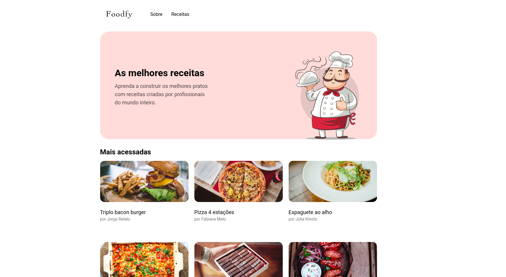

<h3 align="center">
    
      
    <b>Foodfy. Melhores receitas</b>  
     
</h3>

  
  <a>
  
    

  # Índice

- [Sobre](#sobre)
- [Tecnologias Utilizadas](#tecnologias-utilizadas)

  ## :bookmark: Sobre

O <strong>Foodfy</strong> é uma aplicação Web para encontrar as melhores receitas.

Essa aplicação foi construída no Bootcamp <strong>Launchbase</strong> da [Rocketseat](https://rocketseat.com.br/). A ideia de criar uma  aplicação que prepare você para o mercado de <strong>Desenvolvimento Web</strong> .

## :rocket: Tecnologias Utilizadas

O projeto foi desenvolvido utilizando as seguintes tecnologias:

* HTML
* CSS
* JavaScript
* Node.js
* Nunjucks
* Express

## :mortar_board: Quem ministrou?

Os conceitos para esse projeto foram passados pelo mestre **[Mayk Brito](https://github.com/maykbrito)** no BootCamp **Launchbase**.

## :memo: License

Esse projeto está sob a licença MIT. Veja o arquivo [LICENSE](LICENSE.md) para mais detalhes.

---

<h4 align="center">
    Feito com 💜 by <a href="https://www.linkedin.com/in/lfeliperibeiro/" target="_blank">Felipe Ribeiro</a>
</h4>